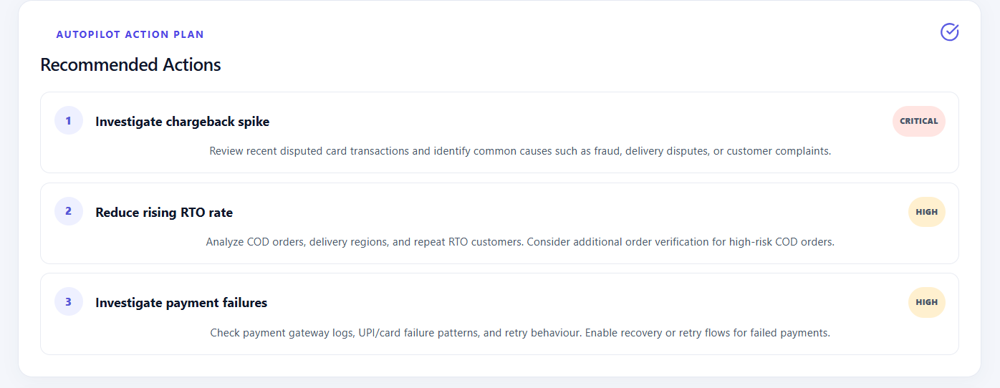
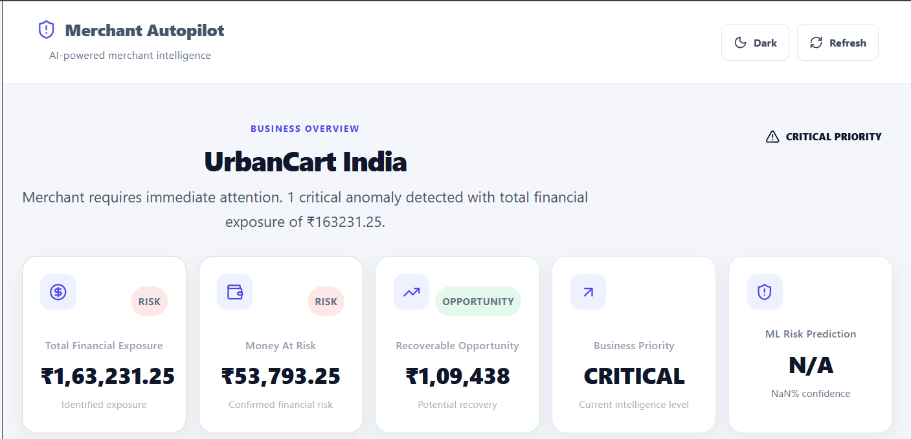
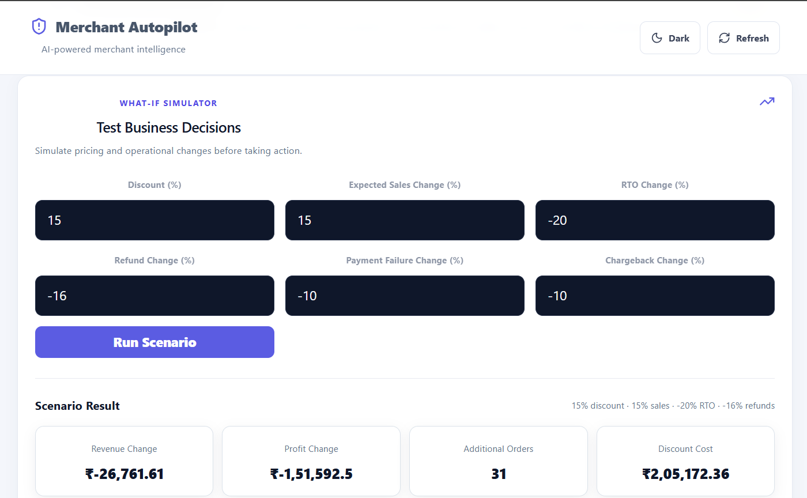
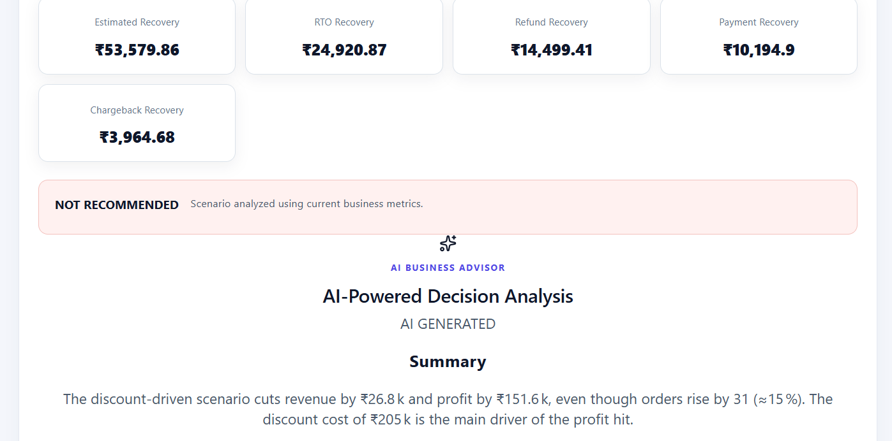

# 🚀 Merchant Autopilot

### AI-Powered Merchant Risk & Decision Intelligence Platform

Merchant Autopilot is a full-stack business intelligence platform that helps online merchants understand operational risks, simulate business decisions, and receive actionable recommendations.

It combines:

- 📊 Merchant analytics
- 🤖 ML-based risk prediction
- 🔮 What-If scenario simulation
- 🧠 AI-powered business advice
- 📈 Financial impact analysis
- ⚠️ Operational risk comparison

---

## 🌐 Live Demo

**Frontend:**  
https://merchant-autopilot.vercel.app/

**Backend:**  
https://merchant-autopilot.onrender.com/

---

## 🎯 Problem Statement

Online merchants face operational risks such as:

- Return-to-Origin (RTO)
- Refunds
- Payment failures
- Chargebacks
- Revenue fluctuations
- Discount costs
- Profit uncertainty

Traditional dashboards mainly answer:

> "What happened?"

Merchant Autopilot goes one step further:

> **"What will happen if I change this?"**

and ultimately:

> **"What should I do?"**

---

# ✨ Key Features

## 📊 Business Intelligence Dashboard

Provides a centralized view of merchant performance:

- Total revenue
- Profit
- Orders
- Operational risk
- RTO
- Refunds
- Payment failures
- Chargebacks
- Critical business issues
- Business insights

---

## 🔮 What-If Simulator

Merchants can modify business parameters and instantly evaluate the potential impact.

### Supported Inputs

| Parameter | Description |
|---|---|
| Discount % | Simulates discount impact |
| Sales Change % | Simulates sales growth or decline |
| RTO Change % | Simulates RTO improvement/deterioration |
| Refund Change % | Simulates refund changes |
| Payment Failure % | Simulates payment failure changes |
| Chargeback % | Simulates chargeback changes |

### Calculated Outputs

- Scenario revenue
- Scenario profit
- Scenario orders
- Scenario risk rates
- Revenue change
- Profit change
- Additional orders
- Discount cost
- Estimated recovery
- RTO recovery
- Refund recovery
- Payment recovery
- Chargeback recovery
- Final recommendation

The system classifies scenarios as:

- ✅ RECOMMENDED
- ⚪ NEUTRAL
- ❌ NOT RECOMMENDED

---

# 🤖 ML-Based Risk Prediction

Merchant Autopilot includes a Python-based machine learning pipeline for merchant risk prediction.

### ML Workflow

```text
Transaction Data
       ↓
Dataset Generation
       ↓
Feature Preparation
       ↓
Model Training
       ↓
Risk Prediction
       ↓
Merchant Risk Intelligence

ML Components

backend/ml/
├── generateDataset.js
├── merchant-risk-dataset.csv
├── merchant-risk-dataset.json
├── predict.py
├── train_model.py
└── risk_model.pkl

The backend invokes the Python prediction pipeline and uses the trained model to generate merchant risk predictions and probability information.

🧠 AI Business Advisor

After a What-If scenario is executed, the system generates decision-oriented business advice.

The advisor can provide:

Summary
Financial Impact
Recommendation
Explanation
Next Step

The application can indicate whether the advice is:

🤖 AI GENERATED
⚙️ RULE BASED
📈 Scenario Analytics

The analytics dashboard compares current business performance with simulated scenario performance.

Financial Comparison

Compares:

Revenue
Profit
Orders
Operational Risk Comparison

Compares:

RTO
Refund
Payment Failure
Chargeback
Risk Distribution

Displays:

Current operational risk
Scenario operational risk

This makes the financial and operational impact of a business decision visually understandable.

🏗️ System Architecture

                    ┌──────────────────────┐
                    │      React + Vite    │
                    │       Frontend       │
                    └──────────┬───────────┘
                               │
                               │ REST API
                               ▼
                    ┌──────────────────────┐
                    │   Node.js + Express  │
                    │       Backend        │
                    └──────────┬───────────┘
                               │
              ┌────────────────┼────────────────┐
              │                │                │
              ▼                ▼                ▼
       ┌────────────┐   ┌──────────────┐  ┌─────────────┐
       │  MongoDB   │   │  What-If     │  │ Risk Engine │
       │ Transactions│  │   Engine     │  │             │
       └────────────┘   └──────────────┘  └──────┬──────┘
                                                 │
                                                 ▼
                                      ┌──────────────────┐
                                      │  Python ML Model │
                                      │  scikit-learn    │
                                      └────────┬─────────┘
                                               │
                                               ▼
                                      ┌──────────────────┐
                                      │   AI Advisor     │
                                      └──────────────────┘

🛠️ Tech Stack
Frontend
React
Vite
JavaScript
Axios
CSS
Backend
Node.js
Express.js
MongoDB
Mongoose
REST APIs
Helmet
Morgan
CORS
Machine Learning
Python
Pandas
NumPy
Scikit-learn
Joblib
Dataset generation
Model training
Risk prediction
AI
AI-powered business advice
Rule-based fallback
Scenario-based decision analysis
Deployment
Vercel — Frontend
Render — Backend
MongoDB — Database


📁 Project Structure      

Merchant-Autopilot/
│
├── backend/
│   ├── config/
│   ├── models/
│   ├── routes/
│   ├── services/
│   ├── scripts/
│   ├── ml/
│   │   ├── generateDataset.js
│   │   ├── merchant-risk-dataset.csv
│   │   ├── merchant-risk-dataset.json
│   │   ├── predict.py
│   │   ├── train_model.py
│   │   └── risk_model.pkl
│   ├── requirements.txt
│   ├── package.json
│   └── server.js
│
├── frontend/
│   ├── src/
│   │   ├── components/
│   │   ├── App.jsx
│   │   ├── App.css
│   │   └── main.jsx
│   └── package.json
│
├── ml-service/
├── docs/
│   └── screenshots/
│
├── .gitignore
└── README.md

⚙️ Installation
1. Clone Repository
git clone https://github.com/parthshukla06/Merchant-Autopilot.git
cd Merchant-Autopilot
2. Backend Setup
cd backend
npm install

Create a .env file:

PORT=5000
MONGO_URI=your_mongodb_connection_string
OPENAI_API_KEY=your_openai_api_key

Start the backend:

npm run dev
3. Python ML Dependencies

From the backend directory:

pip install -r requirements.txt

Required packages include:

joblib
scikit-learn
numpy
pandas
4. Frontend Setup

Open another terminal:

cd frontend
npm install
npm run dev

The frontend will run on the Vite development server.

🔌 API Endpoints
Merchant Intelligence
GET /api/merchants/:merchantId/intelligence

Returns merchant analytics and intelligence data.

ML Risk Prediction
GET /api/merchants/:merchantId/ml-risk

Returns ML-based merchant risk information.

What-If Analysis
POST /api/merchants/:merchantId/what-if

Example request:

{
  "discountPercent": 10,
  "salesChangePercent": 15,
  "rtoChangePercent": -20,
  "refundChangePercent": -15,
  "paymentFailureChangePercent": -20,
  "chargebackChangePercent": -10
}

The API returns:

Current metrics
Scenario metrics
Scenario risk
Financial impact
Recovery estimates
Recommendation
Business advice
🧮 Business Logic

The What-If engine calculates scenario values using the merchant's current metrics.

Orders
New Orders =
Current Orders × (1 + Sales Change / 100)
Revenue
New Revenue =
Current Revenue × (1 + Sales Change / 100)
Discount Cost
Discount Cost =
New Revenue × Discount / 100
Revenue After Discount
Revenue After Discount =
New Revenue - Discount Cost

Operational rates are then adjusted according to scenario changes.

Recovery estimates are calculated from improvements in:

RTO
Refunds
Payment failures
Chargebacks

Finally, the system calculates:

Scenario Profit
Profit Change
Recommendation
## 📸 Screenshots

### Dashboard



### What-If Simulator



### AI Advisor



### Anomaly Detection



🧪 Testing

The application has been tested with:

Positive sales growth
Negative sales growth
Discount changes
RTO improvements
Refund improvements
Payment failure improvements
Chargeback improvements
Invalid input values
Multiple scenario runs
Dynamic analytics updates
🎯 Project Goals

Merchant Autopilot transforms merchant analytics from:

"What happened?"
        ↓
"What could happen?"
        ↓
"What should I do?"
🚀 Future Improvements
Automated merchant alerts
Historical scenario tracking
Advanced ML risk models
Merchant-level personalization
Time-series forecasting
Automated recommendations
Multi-merchant management
Role-based authentication
Advanced financial forecasting


👨‍💻 Author

Parth Shukla

Full Stack Developer | MERN Stack | AI & ML

⭐ Why Merchant Autopilot?

Merchant Autopilot combines:

Full-Stack Development
        +
Data Analytics
        +
Machine Learning
        +
AI
        +
Business Decision Intelligence